# Velociraptor Deployment & Endpoint Detection POC

A hands-on lab demonstrating the deployment of Velociraptor across multiple Windows endpoints, verification of client-server communication, remote command execution via hunts, and safe simulation of common malicious behaviors (fake malware drops, encoded PowerShell, and registry persistence).

**Author:** Sheeza Alam Khan

---

## 📋 Objective

Deploy Velociraptor on multiple Windows machines, verify successful client-server communication, execute commands remotely, and test Velociraptor's ability to detect safe, simulated malicious activity in a controlled and non-destructive manner.

---

## 🖥️ 1. Velociraptor Server Setup

Velociraptor was configured as a server on the host machine. The server was initialized and launched successfully, and the web-based Velociraptor console was accessed through the browser.

Once running, the GUI was used to:
- Manage clients
- Run hunts
- Execute server and client artifacts
- View collected results and logs

---

## 💻 2. Client Deployment on Windows Machines

Velociraptor clients were installed on Windows virtual machines. Each client:
- Was configured with the correct server address
- Was started as a service
- Successfully established communication with the Velociraptor server

**Connected clients — Velociraptor Console**


Four Windows endpoints (`DESKTOP-F57FH34` ×3, `vm-win02`) reported in as **Connected**, confirming client-server communication across the fleet.

---

## ⚙️ 3. Remote Command Execution Test (Hunt Execution)

To verify that Velociraptor can remotely execute commands, **Server Artifacts** were used via hunts.

**Artifact used:** `Windows.System.Cmdshell`

**Commands executed:**
- `whoami`
- `ipconfig`

**Hunts overview**

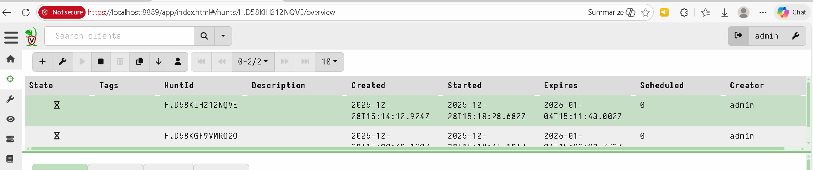

### `whoami` Hunt

| Overview | Clients |
|---|---|
|  |  |


*All 4 clients completed the `whoami` hunt successfully.*

### `ipconfig` Hunt

| Overview | Clients |
|---|---|
| 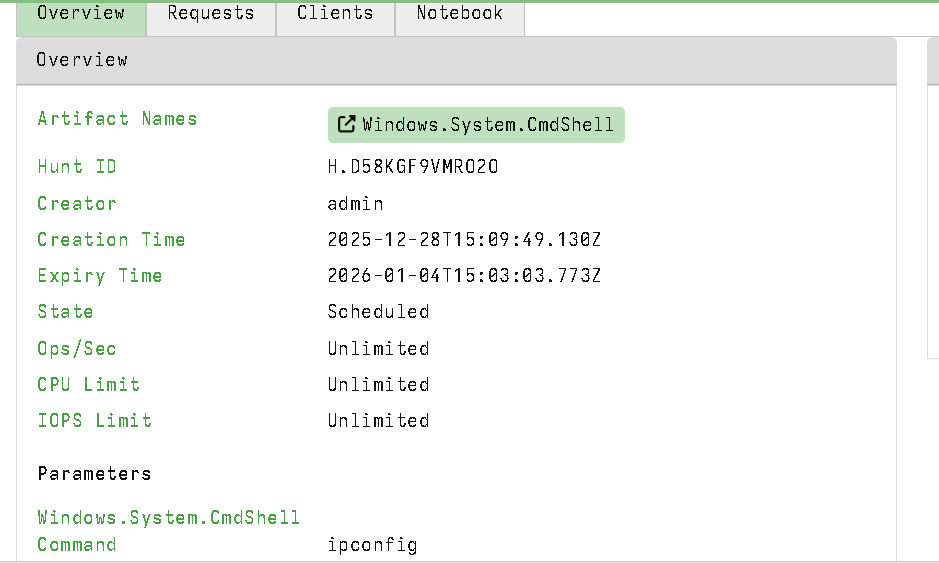 | 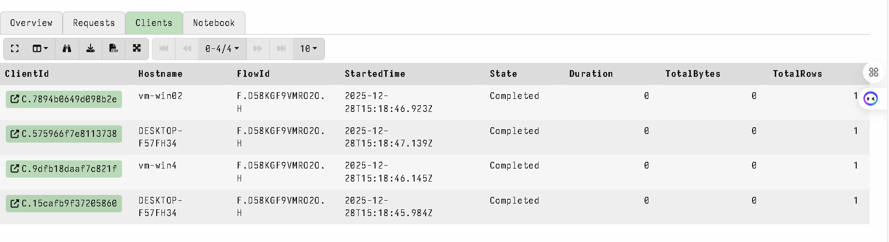 |

*All 4 clients completed the `ipconfig` hunt successfully.*

### Results

- Each command executed successfully
- Output was returned to the Velociraptor console
- Flow IDs were generated for each execution
- Execution time, command details, and results were logged

This confirmed that:
- The server can remotely run commands
- Clients correctly respond
- Output collection works as expected

---

## 🕵️ 4. Simulated Malicious Behavior Detection

### 4.1 Fake Malware File Creation (File Detection Test)

A fake malware-like executable was created safely, intentionally named to resemble a system process:

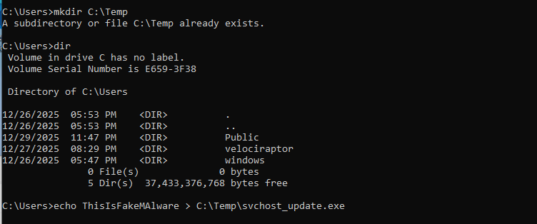

**Artifact used:** `Windows.Search.FileFinder`


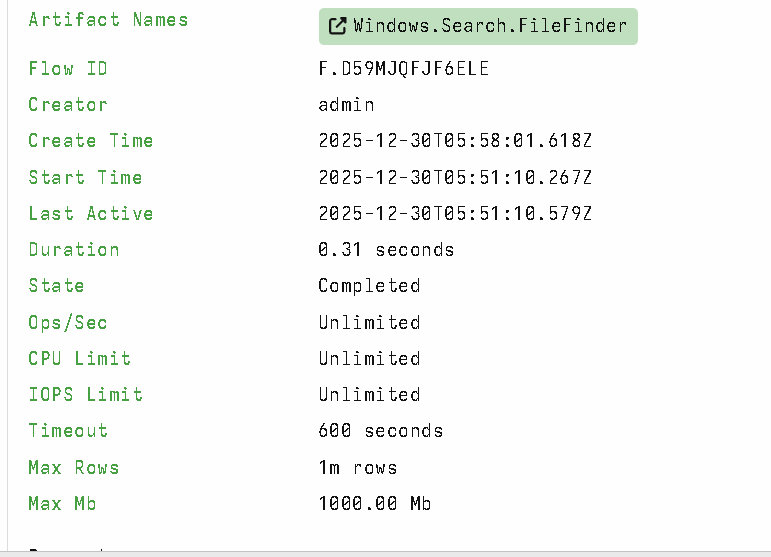

**Parameters** — globbing for executables dropped in `C:\Temp`, with upload and hashing enabled:


**Uploaded file evidence** — the fake payload (`svchost_update.exe`, disguised as a system process) was located and pulled to the server, with its content preview visible:

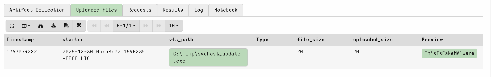

**File metadata & timestamps:**

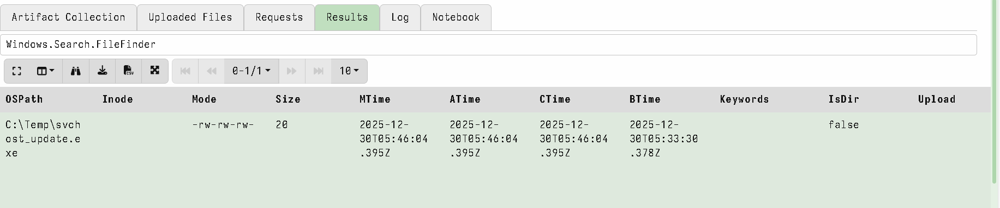

**Execution log:**

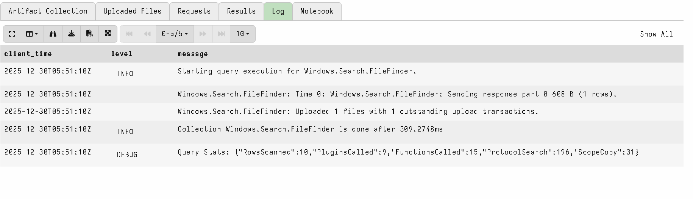

**Results summary:**

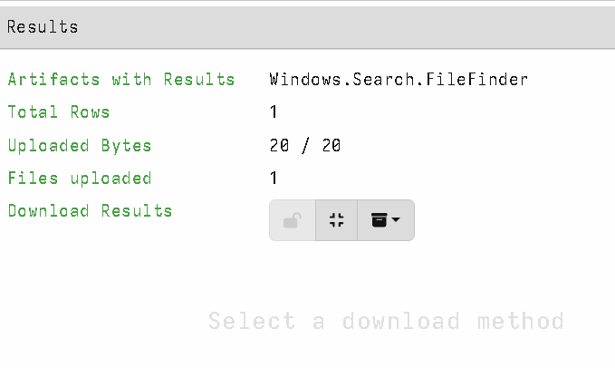

**Results:**

Velociraptor successfully:
- Detected the file
- Uploaded it to the server
- Calculated MD5, SHA1, and SHA256 hashes
- Displayed file metadata and timestamps

**Conclusion:** Velociraptor successfully located the file and collected artifact data, demonstrating file monitoring capabilities.

---

### 4.2 Suspicious PowerShell Execution (Base64-Encoded Command)

A benign PowerShell command (`Get-Date`) was encoded in Base64 and executed:

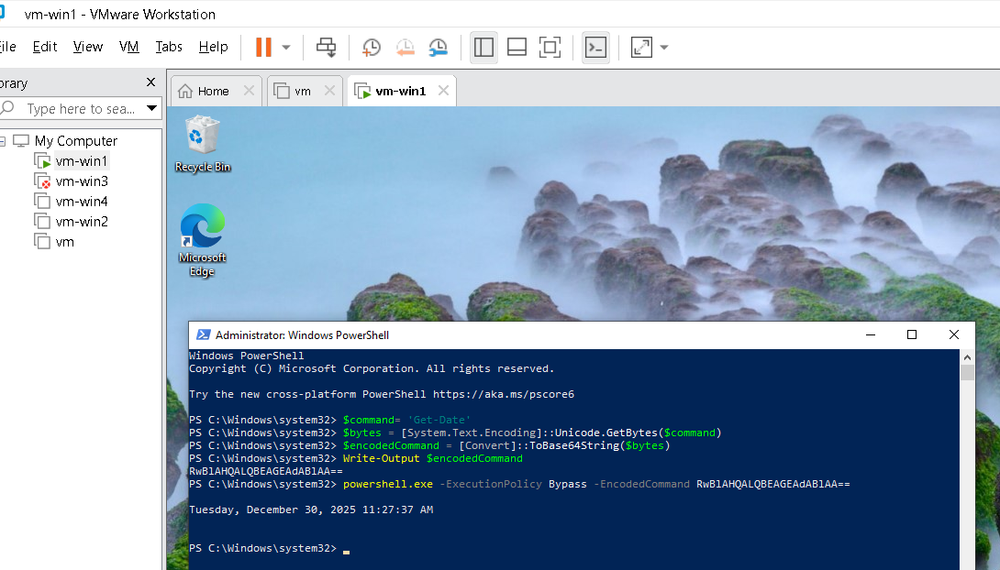

**Artifact used:** `Windows.System.PowerShell`

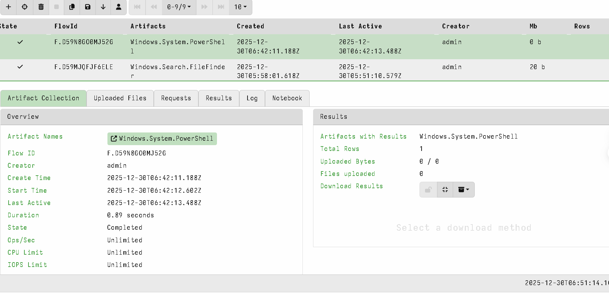

**Command parameters** — the encoded payload as it would appear to a defender:

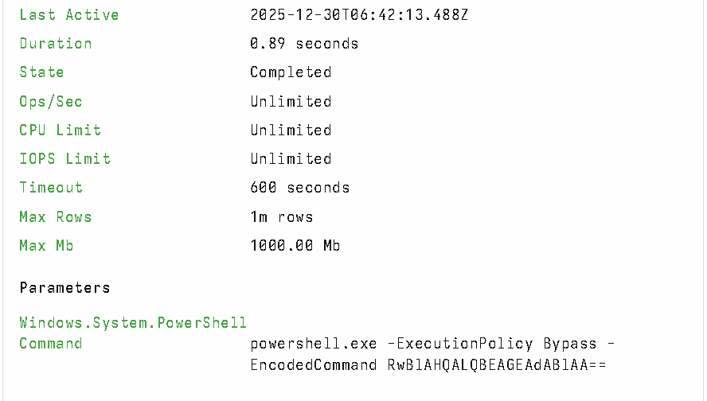

**Execution output:**


Base64-encoded PowerShell commands are commonly used by attackers to:
- Obfuscate malicious scripts
- Evade detection

**Velociraptor Detection:**
- Detected under `Windows.System.Powershell`
- Logged execution details
- Generated a Flow ID
- Recorded execution timestamps and parameters

**Conclusion:** Although the command itself was harmless, Velociraptor correctly logged and captured behavior commonly associated with malicious activity.

---

### 4.3 Registry Run Key Persistence Simulation (Manual)

1. Opened PowerShell and added a benign registry Run key for persistence
2. Verified in `regedit` that the key was created successfully

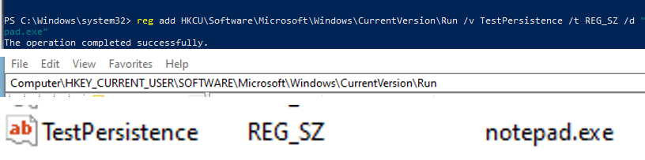

**Conclusion:** Velociraptor detected changes to the registry, confirming its ability to monitor persistence mechanisms.

---

## ✅ Final Conclusion

This task successfully demonstrated the practical use of Velociraptor as an endpoint monitoring and incident response tool. All four Windows machines were connected properly to the Velociraptor server, and remote command execution was verified through simple commands like `ipconfig` and `whoami`, confirming correct client-server communication.

Safe, non-destructive simulations of malicious behavior were performed, including a Base64-encoded PowerShell command, creation of a fake malware-like executable, and manual registry Run key persistence. Velociraptor accurately logged these activities, collected relevant artifacts, and displayed the results in hunts and collections.

Overall, the results show that Velociraptor is effective in detecting suspicious commands, file-based threats, and persistence mechanisms. This setup proves that the environment is correctly configured and capable of supporting real-world security monitoring and forensic investigations.

---

## 📁 Repository Structure

```
.
├── README.md
└── images/
    ├── connected-clients-list.png
    ├── hunts-list-overview.png
    ├── whoami-hunt-overview.png
    ├── whoami-hunt-parameters.png
    ├── whoami-hunt-clients.png
    ├── ipconfig-hunt-overview.png
    ├── ipconfig-hunt-clients.png
    ├── fake-malware-file-creation.png
    ├── filefinder-collection-list.png
    ├── filefinder-overview.png
    ├── filefinder-parameters.png
    ├── filefinder-uploaded-file.png
    ├── filefinder-results-metadata.png
    ├── filefinder-log.png
    ├── filefinder-results-summary.png
    ├── powershell-base64-execution.png
    ├── powershell-artifact-overview.png
    ├── powershell-command-parameters.png
    ├── powershell-results-output.png
    └── registry-run-key-persistence.png
```

## 🛠️ Tools Used

- [Velociraptor](https://docs.velociraptor.app/) — Server + Client
- VMware Workstation (Windows 10 endpoints)
- PowerShell
- Windows Registry Editor (`regedit`)

## 🔍 Artifacts Referenced

- `Windows.System.Cmdshell`
- `Windows.Search.FileFinder`
- `Windows.System.PowerShell`
